# Ergasia2_E18170_KonstantinosTsoutsis
<h1>Endpoint 1 , Create User</h1>

Για να κάνουμε εισαγωγή χρήστη στην βάση δεδομένων αρχικά κάνουμε αναζήτηση για το αν υπάρχει ήδη κάποιος με το ίδιο Email. Η αναζήτηση αυτή γίνεται με την συνάρτηση count. Αν υπάρχει χρήστης με το ίδιο Email τοτε επιστρέφεται μήνυμα λάθος με status = 400 . Αν δεν υπάρχει χρήστης με το Email αυτο τοτε γίνεται κανονικα η εισαγωγη και επιστρέφεται μήνυμα επιτυχίας με status = 200. Στα screenshots βλέπουμε πως κάνουμε πρώτα εγγραφη ενός χρήστη όπου το Email του δεν υπάρχει στην βάση και έτσι γίνεται κανονικα η εισαγώγη και έπειτα προσπαθούμε να ξανά εισάγουμε χρήστη με το ιδιο Email, αυτή η ενέργεια μας επιστρεφει μήνυμα ότι ο χρήστης υπάρχει ήδη .

 
<b>ΕΠΙΤΥΧΗΜΕΝΗ ΕΙΣΑΓΩΓΗ ΧΡΗΣΤΗ</b>
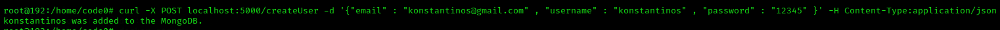
 
<b>ΑΠΟΤΥΧΗΜΕΝΗ ΕΙΣΑΓΩΓΗ ΧΡΗΣΤΗ</b>
 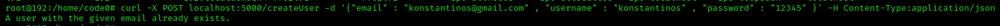
 
 <h1>Endpoint 2 , Login</h1>
 
Για να πραγματοποιηθεί σύνδεση χρήστη πρέπει ο χρήστης να δηλώσει το Email και το password του. Αν αυτά αντιστοιχούν με τα δεδομένα που υπάρχουν στην βαση τότε καλούμε την συνάρτηση create_session όπου παράγει το uuid της σύνδεσης. Έπειτα, αν η σύνδεση πραγματοποιηθεί εμφανίζουμε μήνυμα επιτυχίας καθως και τα στοιχεία Email-uuid. Αντίστοιχα αν δεν μπορει να πραγματοποιηθεί σύνδεση είτε γιατι δεν είναι σωστό το Email είτε γιατί δεν είναι σωστό το password εμφανίζουμε μήνυμα αποτυχιας

 
<b>ΕΠΙΤΥΧΗΜΕΝΗ ΣΥΝΔΕΣΗ</b>
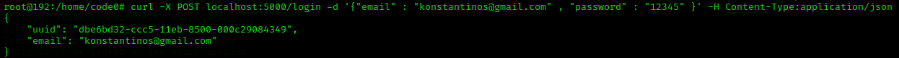
 
<b>ΑΠΟΤΥΧΗΜΕΝΗ ΣΥΝΔΕΣΗ</b>
 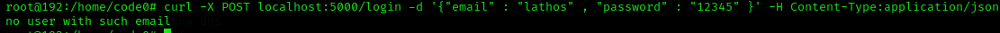  
 
 <h1>Endpoint 3 , Product Info</h1>
 
Για να κάνουμε αναζήτηση προιόντος αρχικά ο χρήστης πρέπει να κάνει σύνδεση. Μόλις γίνει η σύνδεση τότε επιλέγουμε με ποίο χαρακτηριστικό του προιόντος θα γίνει η αναζήτηση. Ο χρήστης γράφει τον τύπο αναζήτησης και την τιμή του και αν τα στοιχεία είναι σωστά εμφανίζει τις πληροφορίες του προιόντος.

 
<b>ΠΛΗΡΟΦΟΡΙΕΣ ΠΡΟΙΟΝΤΟΣ</b>
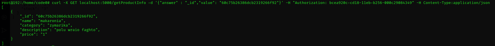
 

<h1>Endpoint 4 , Add Product Into Cart</h1>

Για να προσθέσουμε προιόν στο καλάθι αρχικά ο χρήστης πρέπει να κάνει σύνδεση. Μόλις γίνει η σύνδεση ο χρήστης εισάγει το id του προιόντος καθώς κατι την ποσότητα που θέλει . Αν είναι η πρώτη φορά που γίνεται εισαγωγή προιόντος τότε φτιάχνεται μια λίστα στον συγκεκριμένο χρήστη και γίνεται η εισαγωγή. Αν ο χρήστης έχει ξανα κάνει κάποια προσθήκη τοτε τα προιόντα προστίθονται στην ήδη υπάρχουσα λίστα. Μόλις γίνει επιτυχημένη προσθήκη εμφανίζεται όλο το καλάθι και το συνολικό κόστος. Σε περίπτωση που η ποσότητα που δήλωσε ο χρήστης ξεπρνάει το διαθέσιμο υπόλοιπο εμφανίζεται κατάλληλο μήνυμα , το ίδιο ισχύει και αν το προιόν δεν υπάρχει.

 
<b>ΕΠΙΤΥΧΗΜΕΝΗ ΕΙΣΑΓΩΓΗ </b>
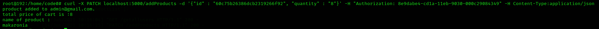
 
<b>ΜΗ ΔΙΑΘΕΣΙΜΟ ΥΠΟΛΟΙΠΟ </b>
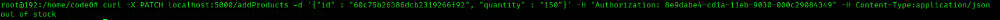
 
<b>ΔΕΝ ΥΠΑΡΧΕΙ ΤΟ ΠΡΟΙΟΝ</b>
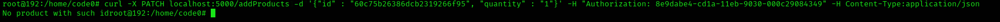
 

<h1>Endpoint 5 , Show Cart</h1>

Για να εμφάνισουμε το καλάθι αρχικά ο χρήστης πρέπει να κάνει σύνδεση. Μόλις γίνει η σύνδεση ο χρήστης εισάγει το email του και εμφανίζονται όλα τα προιόντα που έχει εισάγει στο καλάθι.

 
<b>ΚΑΛΑΘΙ ΧΡΗΣΤΗ</b>
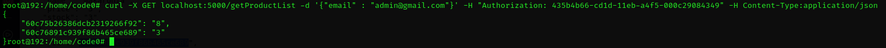
 

<h1>Endpoint 6 , Delete Product From Cart</h1>

Για να διαγράψουμε κάποιο προιόν απο το καλάθι αρχικά ο χρήστης πρέπει να κάνει σύνδεση. Μόλις γίνει η σύνδεση ο χρήστης επιλέγει το προιόν που θέλει να διαγραψει με το id του. Για να ξέρουμε απο ποιόν χρήστη διαγράφουμε το προιόν παίρουμε το uuid της σύνδεσης και κρατάμε το email που υπάρχει σαν δεδομένο. Με αυτον τον τρόπο μπορούμε να γνωρίζουμε ποιός χρήστης κάνει ενέργεια διαγραφής απο την στιγμή που έχει γίνει αυθεντικοποίηση. Αν η διαγραφή είναι επιτυχής τότε εμφανίζεται μήνυμα επιτυχίας καθώς και τα προιόντα που παραμένουν στο καλάθι μαζι με το συνολικό κόστος. Αν δεν υπάρχει το προιόν στο καλάθι επιστρέφεται κατάλληλο μήνυμα. Στο κομμάτι της υλοποίησης για να μπορέσουμε να διαγράψουμε ενα προιόν ψάχνουμε αν υπάρχει αυτο το προιόν στο καλάθι του συγκεκριμένου χρήστη με βάση το id του προιόντος και το διαγράφουμε

 
<b>ΕΠΙΤΥΧΗΜΕΝΗ ΔΙΑΓΡΑΦΗ</b>
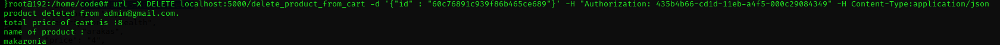
 
 
<b>ΔΕΝ ΥΠΑΡΧΕΙ ΤΟ ΠΡΟΙΟΝ</b>
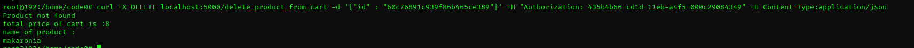
 

<h1>Endpoint 7 , Buy Product</h1>

Για να γίνει αγορά προιόντος απο το χρήστη πρέπει να γίνει συνδεση όπως έχουμε αναφέρει και προηγουμένος. Στην ένεργεια αγοράς ο χρήστης καλείται να εισάγει τον αριθμό κάρτας του που είναι ίσος με 16 ψηφία. Αν τα στοιχεία του χρήστη είναι σωστά δημιουργείται μια λίστα όπου μέσα της τοποθετούνται τα προιόντα που προηγουμένος ήταν στο καλάθι και το καλάθι γίνεται κενό. Έπειτα, αφού έχει ολοκληρωθεί η διαδικασία αγοράς εκτυπωνεται η απόδειξη που περιέχει τα ονόματα προιόντων , την ποσότητα και την τιμή τους . Σε περίπτωση που δεν δωθούν σωστά στοιχεία εμφανίζεται μήνυμα λάθους.

 
<b>ΕΠΙΤΥΧΗΜΕΝΗ ΑΓΟΡΑ</b>
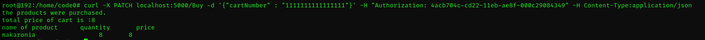
 
 
<b>ΜΗ ΕΓΚΥΡΗ ΚΑΡΤΑ</b>
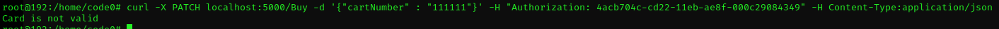
 

<h1>Endpoint 8 , Transaction History</h1>

Για να γίνει εμφάνισει ιστορικόυ του συγκεκριμένου χρήστη ακολουθούμε την διαδικασία σύνδεσης όπως παραπάνω. Με την επιτυχημένη σύνδεση και εντοπισμό του σωστού χρήστη εμφανίζουμε τα δεδομένα που υπάρχουν στην λίστα αγορών που δημιουργήθηκε στο προηγούμενο ερώτημα.

 
<b>ΙΣΤΟΡΙΚΟ ΠΑΡΑΓΓΕΛΙΩΝ</b>
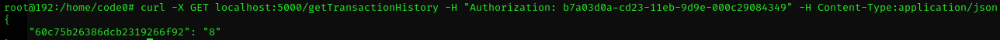
 

<h1>Endpoint 9 , Delete User</h1>

Για να διαγράψουμε ενα χρήστη απο το πληροφοριακό σύστημα ακολουθούμε την διαδικασία σύνδεσης όπως παραπάνω. Με την επιτυχημένη σύνδεση και εντοπισμό του σωστού χρήστη εκτελούμε την διαγραφή και εμφανίζουμε μήνυμα επιτυχίας. Αν δεν βρεθεί ο χρήστης εμφανιζουμε μήνυμα αποτυχίας.

 
<b>ΕΠΙΤΥΧΗΜΕΝΗ ΔΙΑΓΡΑΦΗ</b>
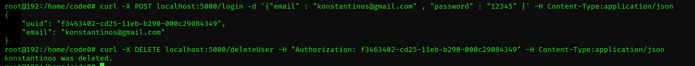
 

Όπως βλέπουμε αν πάμε να κάνουμε σύνδεση με αυτόν τον λογαριασμό έπειτα απο την διαγραφή δεν μπορεί να εντοπίσει τον χρήστη.

 
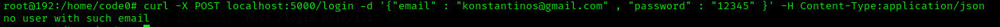
 

<h1>Endpoint 10 , Add New Product</h1>
<b>Κάθε χρήστης ανήκει σε μία κατηγορία. Οί κατηγορίες είναι 'customer' και 'admin', για τα επόμενα endpoints ο χρήστης πρέπει να είναι admin.</b>

Για να γίνει εισαγωγή νέου προιόντος ο χρήστης συνδέεται στο σύστημα και εισάγει τα χαρακτηριστικά του προιόντος. Έπειτα, γίνεται έλεγχος για το αν η κατηγορία χρήστη ειναι admin και αν είναι ολοκληρώνεται με επιτυχία η εισαγωγή.Αν ο χρήστης δεν είναι admin τοτε εμφανίζεται μήνυμα οτί δεν επιτρέπεται αυτή η ενέργεια.

 
<b>ΕΠΙΤΥΧΗΜΕΝΗ ΕΙΣΑΓΩΓΗ</b>
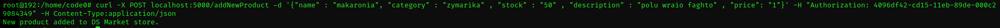
 
<b>ΑΠΟΤΥΧΗΜΕΝΗ ΕΙΣΑΓΩΓΗ</b>
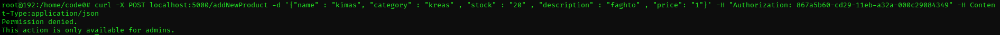
 

<h1>Endpoint 11 , Delete Product</h1>

Για να διαγράψουμε ένα προιόν ακολουθούμε την διαδικασία συνδεσης και εντοπισμό χρήστη. Έπειτα, ο χρηστής δηλώνει το προιόν που θέλει να διαγράψει με το id του. Αν το προιόν υπάρχει διαγράφεται απο την βάση και εμφανίζεται μήνυμα επιτυχίας. Αν δεν υπάρχει αμφανίζεται αντίστοιχο μήνυμα. 

 
<b>ΕΠΙΤΥΧΗΜΕΝΗ ΔΙΑΓΡΑΦΗ</b>
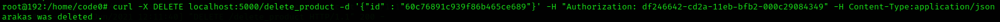
 
<b>ΑΠΟΤΥΧΗΜΕΝΗ ΔΙΑΓΡΑΦΗ</b>
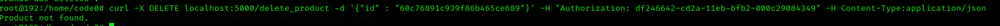
 

<h1>Endpoint 12 , Update Product</h1>

Για να ενημερώσουμε ένα η περισσότερα απο τα στοιχεία ενός προιόντος πρέπει ο χρήστης να συνδεθεί και να ταυτοποιηθεί. Έπειτα, ο χρήστης δηλώνει το προιόν που θέλει να τροποποιήσει βάση το id του. Αν το προιόν υπάρχει τότε ανάλογα με το το στοιχείο που θέλει να ενημερώσει ο χρήστης γίνονται η κατάλληλες αλλαγές ώστε να περάστουν οι νέες τιμές.

 
<b>ΕΠΙΤΥΧΗΜΕΝΗ ΕΝΗΜΕΡΩΣΗ</b>
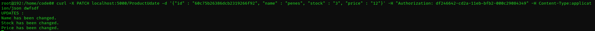
 
 
<h1>Containerization</h1>

Για το Containerization δημιουργήθηκε ο φάκελος 'askExamPs' που περιέχει το docker-compose.yml αρχείο , τον φάκελο mongodb στον οποίο θα αποθηκεύτουν τα δεδομένα της βάσης ώστε να αποφευχθεί η απώλει τους και τον φάκελο flask που περιέχει το Dockerfile και το app.py όπου είναι ο πηγαίος κώδικας. Τα βήματα που ακολουθούμε για το Containerization του web service είναι  1) Η εντολή docker-compose build για να δημιουρηθεί το  flask service  2) H εντολή docker-compose up για την ενεργοποιήση του .  3)Μετά απο αυτό είμαστε έτοιμοι να εκτελέσουμε τα endpoints του web service.

